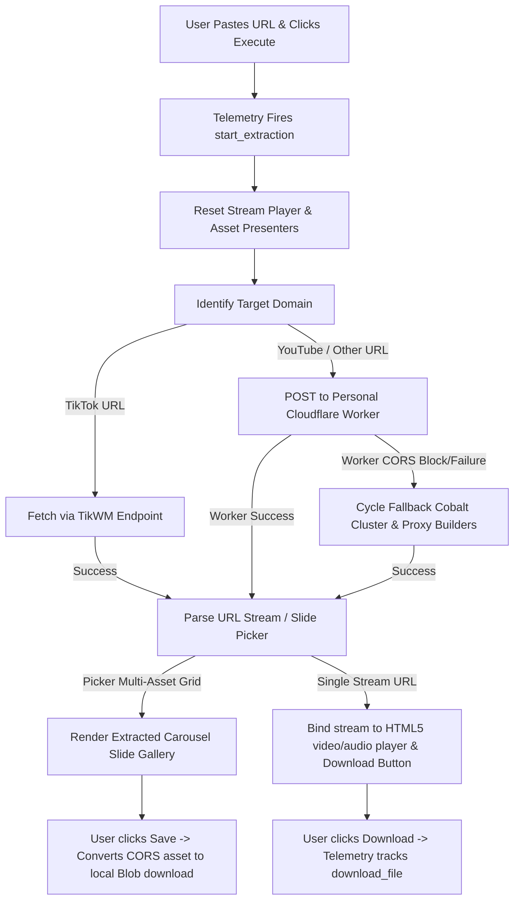

# Universal Video & Audio Downloader Pro
### 🚀 Lossless Media Streamer Core & Extractor Engine

A serverless, high-performance, and visually stunning web tool designed to parse and extract original, lossless media stream segments from major content platforms including **Instagram Reels/Carousels, YouTube, TikTok Slideshows/Videos, Twitter (X), and Facebook**. Built as an installable Progressive Web Application (PWA) with premium SEO tags, GTM/GA4 telemetry, and robust error resilience.

Developed by **[Mehedi Hasan Shihab](https://github.com/sshihabb007)**.

---

## 🌟 Key Features

### 1. Platform-Aware Smart Routing
* **TikTok Integrations**: Automatically detects TikTok URLs and routes them to a highly reliable, CORS-enabled **TikWM API** wrapper. Supports both vertical videos and multi-image slideshow carousels.
* **YouTube and Others**: Leverages high-fidelity **Cobalt API** payload configurations to isolate original video resolutions (up to 1080p) or separate high-bitrate audio streams (up to 320kbps MP3).

### 2. High-Availability CORS Bypass & Failover Pipeline
* **Direct Personal Cloudflare Worker**: Routes first-priority stream extractions through a dedicated personal Cloudflare Worker proxy (`https://cobalt-cors-proxy-udownloader.sshihabb007.workers.dev/`). This completely bypasses standard browser CORS restrictions and avoids third-party rate limits.
* **Multi-Instance Fallback Cluster**: If the primary worker is unreachable, the system automatically cycles through a cluster of public Cobalt API instances combined with diverse CORS proxy decorators (e.g., `corsproxy.io`, `proxy.cors.sh`) to guarantee success.
* **CORS-Safe Local Downloads**: Converted media streams are fetched locally as standard browser `Blob` files using a premium CORS-bypassing pipeline. This enables users to save files directly to their local disk with a single click, rather than forcing them to manually right-click "Save Link As".

### 3. Instagram Carousel & Slideshow Grid Picker
* Fully supports multi-asset payloads. When Instagram or TikTok slide decks are parsed, the engine isolates each image or video frame and presents them inside a gorgeous, fully responsive **glassmorphic gallery grid** (2 columns on mobile, 3 on tablets, 4 on desktops).
* Individual slides include dynamic asset numbering, overlay indicator badges for video types, and separate actions for direct local downloading (*Save*) or opening original assets (*View*).

### 4. Cinematic Widescreen HTML5 Preview Player
* Houses a custom embedded HTML5 preview player (`#mehedi_videoPlayer`) that features adaptive playback controls, a cinematic canvas background, and volume scrubbing.
* Features responsive `object-contain` letterboxing that perfectly renders vertical phone screens (Reels/TikToks) and widescreen horizontal formats (YouTube).
* Uses high-quality static cover poster fallbacks (YouTube thumbnails, TikWM covers) and preloaded first-frame video decoding to show clear video covers before playing.

### 5. Smart Paste & Clipboard Integration
* Includes a premium clipboard paste button (`#mehedi_pasteBtn`) built inside the input container.
* Automatically reads browser clipboards using `navigator.clipboard.readText()` and falls back gracefully to a prompt dialog when clipboard access permissions are restricted.

### 6. Real-Time Visual Diagnostics Terminal
* An embedded terminal outputs progress logs in real-time (`0% - 100%`) with customized retro loading animations.
* Integrates a global client-side error visualizer at the top of the body that captures uncaught exceptions (`window.onerror`) and unhandled promise rejections (`unhandledrejection`), presenting detailed source file, line number, and stack traces inside legible dark/light mode diagnostic cards.

### 7. Full PWA Standalone Operation
* Built as an installable Progressive Web Application complying with modern browser install criteria.
* Local PWA manifest features customized application descriptions, scopes, category tags, startup orientations, and a three-tier adaptive icon scheme (`any` and `maskable` resolutions).
* Fully cached by the root Service Worker (`sw.js`) utilizing a robust stale-while-revalidate strategy for instant offline launching and sub-millisecond asset loading.

### 8. Premium Search Engine Optimization (SEO)
* Highly optimized title headers and descriptions targeting organic developer and utility search queries.
* Complete OpenGraph and Twitter Cards metadata for beautiful preview cards during social sharing.
* Embedded Google-compliant **JSON-LD Structured Data Schema** (`WebApplication`) to trigger high-visibility rich snippets in Google Search results.

### 9. Adblocker-Resilient GA4 / GTM Telemetry
* Implements a defensive analytics helper `shihab_trackEvent` that performs strict runtime validations to ensure script operation is never interrupted if a user's adblocker or privacy extension disables Google Tag Manager.
* Tracks micro-interactions and metrics including Toggle switches (video vs audio), Clipboard paste clicks, Extraction attempts, Success profiles (single asset vs carousel galleries), Failures, and direct downloads.

---

## 🛠️ Technology Stack & Dependencies

* **Frontend Structure**: HTML5 (Semantic elements)
* **Styling & Theme Engine**: Tailwind CSS (Utility classes) + Custom Vanilla CSS (Advanced glassmorphism, responsive grids, active sliding toggle animations, and color variable theme tokens).
* **Application Logic**: Vanilla JavaScript (ES6 Modules, Fetch API, Clipboard API, Service Workers, Blob Stream parsing).
* **Icons & Typographies**: Google Fonts (Inter/Outfit) & Font Awesome 6 Pro (Font glyphs).
* **Analytics**: Google Tag Manager (`GTM-537NPQRV`) & Google Analytics 4 (`G-3JN6PYW17Z`).

---

## 📂 File Architecture

```
universal-downloader/
│
├── index.html          # Core user interface, GTM/GA trackers, visual overlays, and JSON-LD
├── style.css           # Premium glassmorphic themes, responsive layout rules, and toggle slider animations
├── script.js          # Core logical pipelines, safe telemetry, failover cluster, and picker grid builder
├── manifest.json       # Local PWA install configuration, categories, and maskable icons
└── cloudflare-worker.js # Personal proxy script deployed on Cloudflare Workers for CORS-free API wrapping
```

---

## ⚙️ How It Works (Technical Lifecycle)



1. **Parameters Verification**: The system validates that the target input has a valid format.
2. **Extraction Handshake**: The engine runs `sshihabb007_detectPlatform()` and sends standard payload parameters to the serverless pipeline (Cloudflare Worker proxy or fallbacks).
3. **Log Printing**: Progress details are pushed directly to the UI terminal (`mehedi_writeLog`) at calculated checkpoints.
4. **DOM Parsing**: On response, if a slide picker is returned, it loops and creates unique DOM tree nodes with dynamic `Blob` action attachments. If a stream URL is returned, it binds the source directly to the video tag and invokes `.load()`.
5. **Telemetry Flush**: Calls `shihab_trackEvent` to pass telemetry events to the global `dataLayer` without interrupting standard browser execution.
